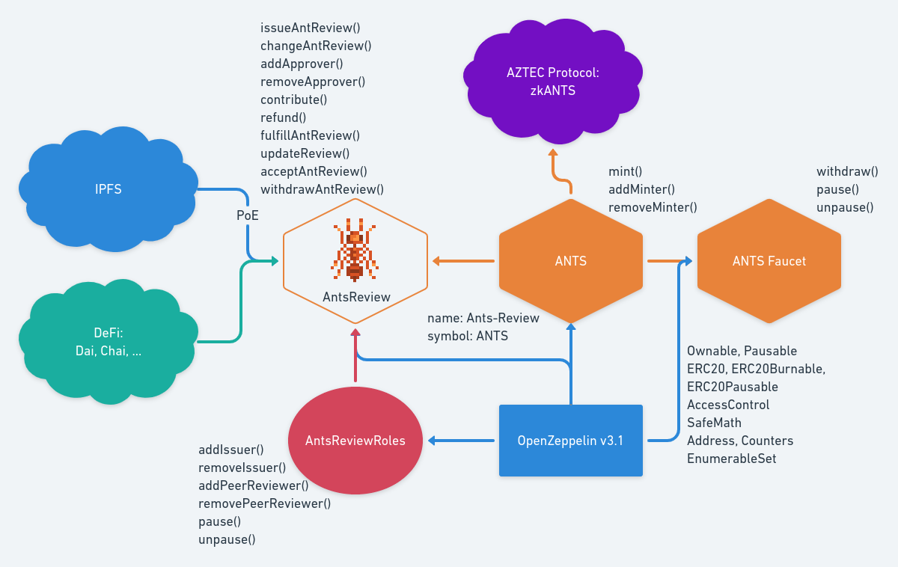

[](https://ubuntu.com/download/desktop)
[](https://github.com/nvm-sh/nvm#installation-and-update)
[](https://www.trufflesuite.com/)
[](https://github.com/ethereum/solidity/releases/tag/v0.6.10)
[](https://rinkeby.etherscan.io/address/0x6956dF88120c44fb446761947cD4B83b553F229F)

[](https://ethturin.com)
[](https://zenodo.org/badge/latestdoi/258342275)  


# Ants-Review
> A Protocol for Open Anonymous Scientific Peer-Reviews on Ethereum  
> :1st_place_medal: 1st Place at [ETHTurin Hackathon](https://ethlocal.co/ethturin/hacks)

The Project implements a basic Bounty-like contract called AntsReview to allow anyone to issue an AntReview in ETH, a bounty for peer-review in scientific publication, linked to requirements stored on ipfs which anyone can fufill by submitting the ipfs hash which contains evidence of their fufillment.  
After the submission of successful peer-reviews, they will be audited by an external Editor and payed by the Issuer.  
To incentivise ethical behaviour the system will implement a quadratic funding on AntsReview.

The Project is intended to be used as a template for developing the idea presented in the white paper, extending its functionality via the following steps:

- Quadratic Funding Gitcoin-like for AntsReview.
- ERC20 token, name Ant, symbol ANT.
- zkANT, allowing private ANT transactions on Ethereum using ZK-SNARKs via AZTEC Protocol.
- Timestamped on Ethereum via PoE (Proof of Existence).
- Storing on IPFS.
- ENS, allowing human-readable Ethereum addresses
- Upgradability, to allow the logic to be extended and improved.
- ...

[White Paper](https://zenodo.org/record/3828087#.Xr8XVXVKg5k)  
[Presentation](https://zenodo.org/record/3828067#.Xr8Pv3VKg5k)  
[Demo](https://youtu.be/9FMsM5otQVM)  



Project Setup
============

Clone this GitHub repository.

# Steps to compile and deploy

  - Local dependencies:
    - Truffle
    - Ganache CLI
    - OpenZeppelin Library v3.0
    - Truffle HD Wallet Provider
    - Truffle Flattener
    ```sh
    $ npm i
    ```
  - Global dependencies:
    - MythX for Truffle (optional):
    ```sh
    $ npm install -g truffle-security
    ```
## Running the project with local test network (ganache-cli)

   - Start ganache-cli with the following command:
     ```sh
     $ ganache-cli
     ```
   - Compile the smart contract using Truffle with the following command:
     ```sh
     $ truffle compile
     ```
   - Deploy the smart contracts using Truffle & Ganache with the following command:
     ```sh
     $ truffle migrate
     ```
   - Test the smart contracts using Truffle & Ganache with the following command:
     ```sh
     $ truffle test
     ```
   - Analyze the smart contracts using MythX for Truffle with the following command (optional):
     ```sh
     $ truffle run verify
     ```
## Deploying on Rinkeby's Testnet
  - Get an Ethereum Account on Metamask.
  - On the landing page, click “Get Chrome Extension.”
  - Create a .secret file cointaining the menomic.
  - Get some test ether from a [Rinkeby's faucet](https://faucet.rinkeby.io/).
  - Signup [Infura](https://infura.io/).
  - Create new project.
  - Copy the rinkeby URL into truffle-config.js.
  - Uncomment the following lines in truffle-config.js:
    ```
    // const HDWalletProvider = require("@truffle/hdwallet-provider");
    // const infuraKey = '...';
    // const infuraURL = 'https://rinkeby.infura.io/...';

    // const fs = require('fs');
    // const mnemonic = fs.readFileSync(".secret").toString().trim();
    ```
  - Install Truffle HD Wallet Provider:
    ```sh
    $ npm install @truffle/hdwallet-provider
    ```
  - Deploy the smart contract using Truffle & Infura with the following command:
    ```sh
    $ truffle migrate --network rinkeby
    ```

    The Project's smart contract have been deployed on [Rinkeby](https://rinkeby.etherscan.io/address/0x6956dF88120c44fb446761947cD4B83b553F229F).  
   The ABIs are available to test the project on Rinkeby's Network.

   ## Using the DApp
  - Install [Ganache GUI](https://www.trufflesuite.com/ganache).
  - Change Ganache GUI port to 8545.
  - Import Ganache GUI mnemonic into MetaMask.
  - Connect MetaMask to Ganache GUI, adding a custom RPC specifing the Ganache GUI's RPC server URL.
  - Deploy the smart contracts to Ganache GUI:
    ```
    $ truffle migrate
    ```
  - Move to client directory on the project:
    ```
    $ cd client
    ```
  - Install dependencies:
    ```
    $ npm install
    $ yarn install
    ```
  - Start the Local Web Server:
    ```sh
    $ npm run start
    ```
  - Interacting with the User Interface (Proof of Concept):
    - Anyone can add an AntReview specifying IPFS Has of requirements, Deadline Timestamp, Ether value of the AntReview reward.

 The DApp (PoC) has been deployed on IPFS via [Fleek](https://fleek.co/): https://antsreview.on.fleek.co


## Inspiration & References

[](https://github.com/naszam/awesome-antsreview/blob/master/README.md#references)


## About
Project created by Team MetaBounty for ETHTurin 2020 Hackathon.  
Research and Design by [Bianca Trovò](https://www.linkedin.com/in/bianca-m-trovo/)  
Smart Contracts and Architecture by [Nazzareno Massari](http://nazzarenomassari.com)
